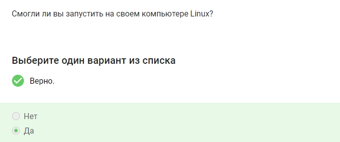
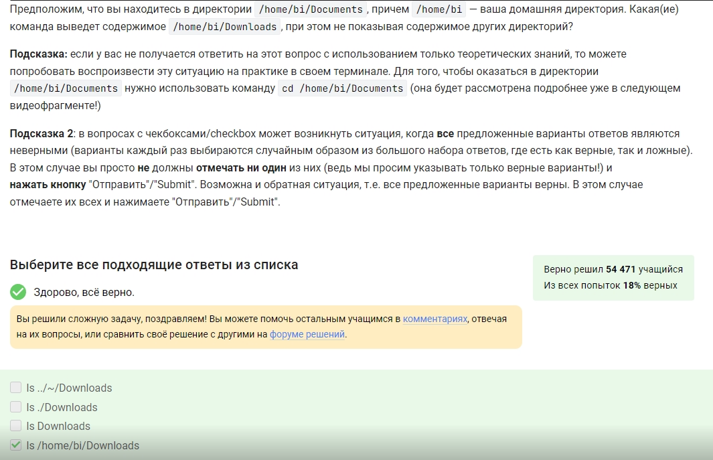
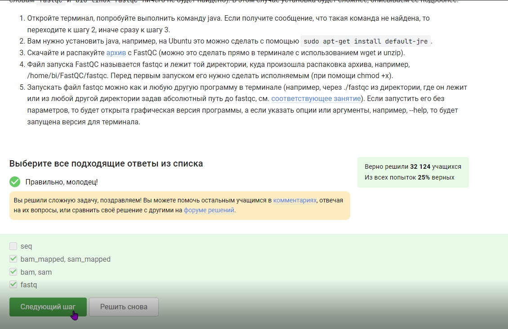
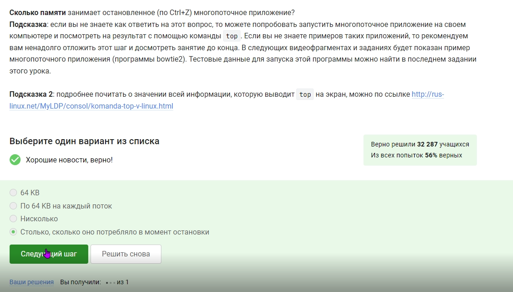
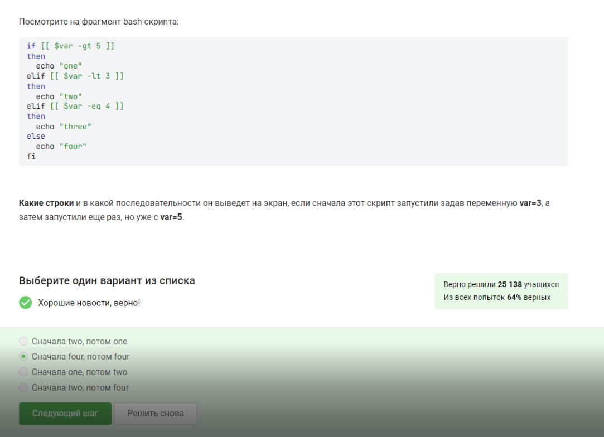
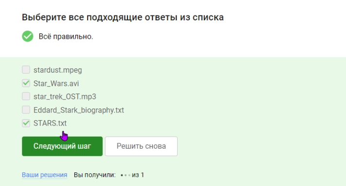

---
## Front matter
title: "Отчет по прохождению внешнего курса"
author: "Спелов Андрей Николаевич НПИбд-02-23"

## Generic otions
lang: ru-RU
toc-title: "Содержание"

## Bibliography
bibliography: bib/cite.bib
csl: pandoc/csl/gost-r-7-0-5-2008-numeric.csl

## Pdf output format
toc: true # Table of contents
toc-depth: 2
lof: true # List of figures
lot: true # List of tables
fontsize: 12pt
linestretch: 1.5
papersize: a4
documentclass: scrreprt
## I18n polyglossia
polyglossia-lang:
  name: russian
  options:
	- spelling=modern
	- babelshorthands=true
polyglossia-otherlangs:
  name: english
## I18n babel
babel-lang: russian
babel-otherlangs: english
## Fonts
mainfont: PT Serif
romanfont: PT Serif
sansfont: PT Sans
monofont: PT Mono
mainfontoptions: Ligatures=TeX
romanfontoptions: Ligatures=TeX
sansfontoptions: Ligatures=TeX,Scale=MatchLowercase
monofontoptions: Scale=MatchLowercase,Scale=0.9
## Biblatex
biblatex: true
biblio-style: "gost-numeric"
biblatexoptions:
  - parentracker=true
  - backend=biber
  - hyperref=auto
  - language=auto
  - autolang=other*
  - citestyle=gost-numeric
## Pandoc-crossref LaTeX customization
figureTitle: "Рис."
tableTitle: "Таблица"
listingTitle: "Листинг"
lofTitle: "Список иллюстраций"
lotTitle: "Список таблиц"
lolTitle: "Листинги"
## Misc options
indent: true
header-includes:
  - \usepackage{indentfirst}
  - \usepackage{float} # keep figures where there are in the text
  - \floatplacement{figure}{H} # keep figures where there are in the text
---

# Цель работы

Пройти курс, получить сертификат

# Прохождение внешнего курса

## Введение

Название курса (рис. [-@fig:001]).

{#fig:001 width=70%}

Информация о курсе (рис. [-@fig:002]).

{#fig:002 width=70%}

Своя операционная система (рис. [-@fig:003]).

{#fig:003 width=70%}

Что такое виртуальная машина (рис. [-@fig:004]).

{#fig:004 width=70%}

Запуск Linux (рис. [-@fig:005]).

{#fig:005 width=70%}

Расширения установочных пакетов (рис. [-@fig:006]).

{#fig:006 width=70%}

Использование приложение Update Manager (рис. [-@fig:007]).

{#fig:007 width=70%}

Написать Hello,Linux! в LibreOffice (рис. [-@fig:008]).

{#fig:008 width=70%}

Узнать имя в плеере на Linux (рис. [-@fig:009]).

{#fig:009 width=70%}

Синонимы "Командной строки" (рис. [-@fig:010]).

{#fig:010 width=70%}

Узнаем директорию (рис. [-@fig:011]).

{#fig:011 width=70%}

Задание на определение дирректории (рис. [-@fig:012]).

{#fig:012 width=70%}

Команда для удаления директорий (рис. [-@fig:013]).

{#fig:013 width=70%}

Эквивалентность команде (рис. [-@fig:014]).

{#fig:014 width=70%}

Команда exit (рис. [-@fig:015]).

{#fig:015 width=70%}

Эквивалентность запуска программы (рис. [-@fig:016]).

{#fig:016 width=70%}

Выполняем задание (рис. [-@fig:017]).

{#fig:017 width=70%}

Задание (рис. [-@fig:018]).

{#fig:018 width=70%}

Вывод ошибок (рис. [-@fig:019]).

{#fig:019 width=70%}

Сообщение об ошибках (рис. [-@fig:020]).

{#fig:020 width=70%}

Задание (рис. [-@fig:021]).

{#fig:021 width=70%}

Опция, чтобы не выводились сообщения (рис. [-@fig:022]).

{#fig:022 width=70%}

Задание (рис. [-@fig:023]).

{#fig:023 width=70%}

Различие архиваторов (рис. [-@fig:024]).

{#fig:024 width=70%}

Архиваторы для создания архива с директориями (рис. [-@fig:025]).

{#fig:025 width=70%}

Запаковка файлов (рис. [-@fig:026]).

{#fig:026 width=70%}

Макска команд (рис. [-@fig:027]).

{#fig:027 width=70%}

Поиск по маске (рис. [-@fig:028]).

{#fig:028 width=70%}

Задние (рис. [-@fig:029]).

{#fig:029 width=70%}

## Работа на сервере

Использование удаленного сервера (рис. [-@fig:030]).

{#fig:030 width=70%}

Выбор безопасного ключа для пересылки по интернету (рис. [-@fig:031]).

{#fig:031 width=70%}

Копирование на сервер (рис. [-@fig:032]).

{#fig:032 width=70%}

Решение проблем с установкой (рис. [-@fig:033]).

{#fig:033 width=70%}

Использование Filezilla (рис. [-@fig:034]).

{#fig:034 width=70%}

Запуск с экраном (рис. [-@fig:035]).

{#fig:035 width=70%}

Справочная информация о программе (рис. [-@fig:036]).

{#fig:036 width=70%}

Задание (рис. [-@fig:037]).

{#fig:037 width=70%}

Посмотреть справку о программе (рис. [-@fig:038]).

{#fig:038 width=70%}

Информация о программах после выполнения команд (рис. [-@fig:039]).

{#fig:039 width=70%}

Идентификаторы (рис. [-@fig:040]).

{#fig:040 width=70%}

Команда, завершающая остановленный процесс (рис. [-@fig:041]).

{#fig:041 width=70%}

Операция kill на приостовленной программе (рис. [-@fig:042]).

{#fig:042 width=70%}

Ресурсы процессора (рис. [-@fig:043]).

{#fig:043 width=70%}

Память при остановке приложения (рис. [-@fig:044]).

{#fig:044 width=70%}

Потоки выполнения шагов (рис. [-@fig:045]).

{#fig:045 width=70%}

Можно ли завершить один из потоков запущенного приложения (рис. [-@fig:046]).

{#fig:046 width=70%}

Задание (рис. [-@fig:047]).

{#fig:047 width=70%}

Задание (рис. [-@fig:048]).

{#fig:048 width=70%}

exit во время tmux (рис. [-@fig:049]).

{#fig:049 width=70%}

Задание (рис. [-@fig:050]).

{#fig:050 width=70%}

Задание (рис. [-@fig:051]).

{#fig:051 width=70%}

Задание (рис. [-@fig:052]).

{#fig:052 width=70%}

Задание (рис. [-@fig:053]).

{#fig:053 width=70%}

## Продвинутые темы

Выход из режима vim (рис. [-@fig:054]).

{#fig:054 width=70%}

Задание (рис. [-@fig:055]).

{#fig:055 width=70%}

Набор клавишей редактирования (рис. [-@fig:056]).

{#fig:056 width=70%}

Задание (рис. [-@fig:057]).

{#fig:057 width=70%}

Задание (рис. [-@fig:058]).

{#fig:058 width=70%}

Задание (рис. [-@fig:059]).

{#fig:059 width=70%}

Задание (рис. [-@fig:060]).

{#fig:060 width=70%}

Задание (рис. [-@fig:061]).

{#fig:061 width=70%}

Задание (рис. [-@fig:062]).

{#fig:062 width=70%}

Вывод скрипта (рис. [-@fig:063]).

{#fig:063 width=70%}

Задание (рис. [-@fig:064]).

{#fig:064 width=70%}

Задание (рис. [-@fig:065]).

{#fig:065 width=70%}

Задание (рис. [-@fig:066]).

{#fig:066 width=70%}

Задание (рис. [-@fig:067,1]).

{#fig:067,1 width=70%}

Программа (рис. [-@fig:067,2]).

{#fig:067,2 width=70%}

Задание (рис. [-@fig:068]).

{#fig:068 width=70%}

Задание (рис. [-@fig:069]).

{#fig:069 width=70%}

Задание (рис. [-@fig:070]).

{#fig:070 width=70%}

Задание (рис. [-@fig:071,1]).

{#fig:071,1 width=70%}

Делаем задание и смотрим на вывод (рис. [-@fig:071,2]).

{#fig:071,2 width=70%}

Задание (рис. [-@fig:072,1]).

{#fig:072,1 width=70%}

Готовая программа (рис. [-@fig:054]).

{#fig:054 width=70%}

Задание (рис. [-@fig:073,1]).

{#fig:073,1 width=70%}

Программа (рис. [-@fig:073,2]).

{#fig:073,2 width=70%}

Файл в директории (рис. [-@fig:074]).

{#fig:074 width=70%}

Работа опций (рис. [-@fig:075]).

{#fig:075 width=70%}

Команда без опции (рис. [-@fig:076]).

{#fig:076 width=70%}

Задание (рис. [-@fig:077,1]).

{#fig:077,1 width=70%}

Выбираем правильные варианты (рис. [-@fig:077,2]).

{#fig:077,2 width=70%}

Выбираем правильные варианты ответы (рис. [-@fig:078]).

{#fig:078 width=70%}

Выполняем задание (рис. [-@fig:079]).

{#fig:079 width=70%}

Задание (рис. [-@fig:080,1]).

{#fig:080,1 width=70%}

Записываем инструкцию (рис. [-@fig:080,2]).

{#fig:080,2 width=70%}

Опция при запуске (рис. [-@fig:081]).

{#fig:081 width=70%}

Задание (рис. [-@fig:082]).

{#fig:082 width=70%}

Задание (рис. [-@fig:083]).

{#fig:083 width=70%}

Изменяем файл и выписываем его (рис. [-@fig:084]).

{#fig:084 width=70%}

Создание 3х поддиректорий (рис. [-@fig:085]).

{#fig:085 width=70%}

Кол-во места (рис. [-@fig:086]).

{#fig:086 width=70%}

Характиристики файла с командой (рис. [-@fig:087]).

{#fig:087 width=70%}

Задание (рис. [-@fig:088]).

{#fig:088 width=70%}

Права доступа у файла (рис. [-@fig:089]).

{#fig:089 width=70%}

Получаем сертификат об окончании курса (рис. [-@fig:090]).

{#fig:090 width=70%}

# Выводы

Мы прошли курс и получили сертификат.

# Список литературы{.unnumbered}

::: {#refs}
:::
