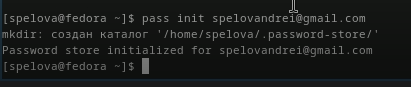
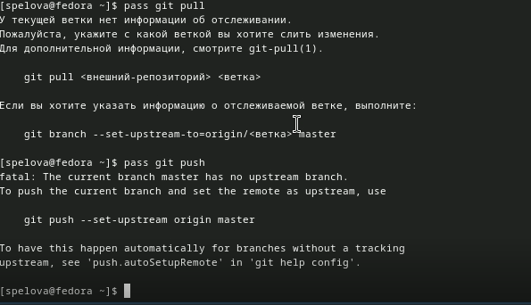
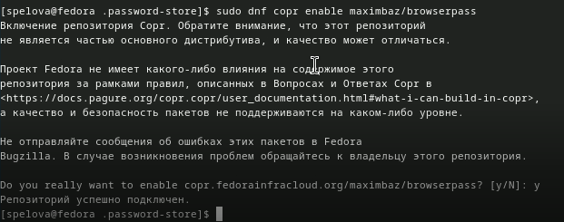
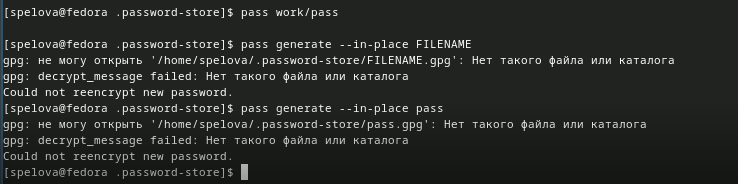

---
## Front matter
lang: ru-RU
title: Лабораторная работа №5
subtitle: Простые сети в GNS3. Анализ трафика
author:
  - Спелов А. Н.
institute:
  - Российский университет дружбы народов, Москва, Россия
date: 7 ноября 2025

## i18n babel
babel-lang: russian
babel-otherlangs: english

## Formatting pdf
toc: false
toc-title: Содержание
slide_level: 2
aspectratio: 169
section-titles: true
theme: metropolis
header-includes:
 - \metroset{progressbar=frametitle,sectionpage=progressbar,numbering=fraction}
 - '\makeatletter'
 - '\beamer@ignorenonframefalse'
 - '\makeatother'

## Fonts
mainfont: PT Serif
romanfont: PT Serif
sansfont: PT Sans
monofont: PT Mono
mainfontoptions: Ligatures=TeX
romanfontoptions: Ligatures=TeX
sansfontoptions: Ligatures=TeX,Scale=MatchLowercase
monofontoptions: Scale=MatchLowercase,Scale=0.9
---

# Информация

## Докладчик

:::::::::::::: {.columns align=center}
::: {.column width="70%"}

  * Спелов Андрей Николаевич
  * НПИбд-02-23 Студ. билет: 1132231839
  * Российский университет дружбы народов
  * [1132231839@pfur.ru](mailto:1132231839@pfur.ru)

:::
::: {.column width="30%"}
:::
::::::::::::::

# Вводная часть

## Цель работы

- Целью данной работы является построение простейших моделей сети на базе коммутатора и маршрутизаторов FRR и VyOS в GNS3, анализ трафика посредством Wireshark.

# Основная часть

## Моделирование простейшей сети на базе коммутатора в GNS3

- Создание нового проекта в GNS3.

## Моделирование простейшей сети на базе коммутатора в GNS3

- Размещение коммутатора Ethernet и двух VPCS. Изменение названия устройства. Присвоение коммутатору названия. Соединение VPCS с коммутатором. Отображение обозначения интерфейсов соединения.

## Моделирование простейшей сети на базе коммутатора в GNS3

- Просмотр синтаксиса возможных для ввода команд.

## Моделирование простейшей сети на базе коммутатора в GNS3

- Задание IP-адреса и сохранение конфигурации VPCS в GNS3 для PC-1-anspelov.

## Моделирование простейшей сети на базе коммутатора в GNS3

- Задание IP-адреса и сохранение конфигурации VPCS в GNS3 для PC-2-anspelov.

## Моделирование простейшей сети на базе коммутатора в GNS3

- Проверка работоспособности соединения между PC-1 и PC-2.

## Моделирование простейшей сети на базе коммутатора в GNS3

- Остановка в проекте всех узлов.

## Анализ трафика в GNS3 посредством Wireshark

- Запуск на соединении между PC-1-anspelov и коммутатором анализатор трафика.

## Анализ трафика в GNS3 посредством Wireshark

- Отображение информация по протоколу ARP в окне Wireshark.

## Анализ трафика в GNS3 посредством Wireshark

- Просмотр информации по опциям команды ping. Отправка одного эхо-запроса в ICMP-моде к узлу PC-1-anspelov.

## Анализ трафика в GNS3 посредством Wireshark

- Просмотр полученной информации в окне Wireshark.

## Анализ трафика в GNS3 посредством Wireshark

- Отправка одного эхо-запроса в UDP-моде к узлу PC-1-anspelov.

## Анализ трафика в GNS3 посредством Wireshark

- Просмотр полученной информации в окне Wireshark.

## Анализ трафика в GNS3 посредством Wireshark

- Отправка одного эхо-запроса в TCP-моде к узлу PC-1-anspelov.

## Анализ трафика в GNS3 посредством Wireshark

- Просмотр полученной информации в окне Wireshark.

## Анализ трафика в GNS3 посредством Wireshark

- Остановка захвата пакетов в Wireshark.

## Моделирование простейшей сети на базе маршрутизатора FRR в GNS3

- Создание нового проекта в GNS3.

## Моделирование простейшей сети на базе маршрутизатора FRR в GNS3

- Размещение VPCS, коммутатора Ethernet и маршрутизатора FRR. Изменение отображаемых названий устройств.

## Моделирование простейшей сети на базе маршрутизатора FRR в GNS3

- Включение захвата трафика на соединении между коммутатором и маршрутизатором.

## Моделирование простейшей сети на базе маршрутизатора FRR в GNS3

- Открытие консоли всех устройств проекта.

## Моделирование простейшей сети на базе маршрутизатора FRR в GNS3

- Настройка IP-адресации для интерфейса узла PC-1-anspelov.

## Моделирование простейшей сети на базе маршрутизатора FRR в GNS3

- Настроим IP-адресацию для интерфейса локальной сети маршрутизатора и проверим конфигурацию маршрутизатора и настройки IP-адресации

## Моделирование простейшей сети на базе маршрутизатора FRR в GNS3

- Проверка подключения.

## Моделирование простейшей сети на базе маршрутизатора FRR в GNS3

- Получение информации в окне Wireshark.

## Моделирование простейшей сети на базе маршрутизатора FRR в GNS3

- Остановка захвата пакетов в Wireshark.

## Моделирование простейшей сети на базе маршрутизатора VyOS в GNS3

- Создание нового проекта в GNS3.

## Моделирование простейшей сети на базе маршрутизатора VyOS в GNS3

- Размещение VPCS, коммутатора Ethernet и маршрутизатора VyOS. Изменение отображаемых названий устройств.

## Моделирование простейшей сети на базе маршрутизатора VyOS в GNS3

- Включение захвата трафика на соединении между коммутатором и маршрутизатором.

## Моделирование простейшей сети на базе маршрутизатора VyOS в GNS3

- Открытие консолей всех устройств проекта.

## Моделирование простейшей сети на базе маршрутизатора VyOS в GNS3

- Настройка IP-адресации для интерфейса узла PC-1-anspelov.

## Моделирование простейшей сети на базе маршрутизатора VyOS в GNS3

- Ввод логина и пароля. Отображение рабочего режима.

## Моделирование простейшей сети на базе маршрутизатора VyOS в GNS3

- Установка системы на диск. Она уже установлена.

## Моделирование простейшей сети на базе маршрутизатора VyOS в GNS3

- Переход в режим конфигурирования. Изменение имени устройства. Настраивание IP-адреса на интерфейсе eth0. Просмотр внесённых в конфигурацию изменений. Применение изменений в конфигурации и сохранение самой конфигурации.

## Моделирование простейшей сети на базе маршрутизатора VyOS в GNS3

- Просмотр информации об интерфейсах маршрутизатора. Выход из режима конфигурирования.

## Моделирование простейшей сети на базе маршрутизатора VyOS в GNS3

- Проверка подключения.

## Моделирование простейшей сети на базе маршрутизатора VyOS в GNS3

- Получение информации в окне Wireshark.

## Моделирование простейшей сети на базе маршрутизатора VyOS в GNS3

- Завершение работы с GNS3.

# Вывод

## Вывод

- В ходе выполнения лабораторной работы мы научились выполнять построение простейших моделей сети на базе коммутатора и маршрутизаторов FRR и VyOS в GNS3 и научились анализировать трафик посредством Wireshark.