---
## Front matter
lang: ru-RU
title: Лабораторная работа №6
subtitle: Адресация IPv4 и IPv6. Двойной стек
author:
  - Спелов А. Н.
institute:
  - Российский университет дружбы народов, Москва, Россия
date: 20 ноября 2025

## i18n babel
babel-lang: russian
babel-otherlangs: english

## Formatting pdf
toc: false
toc-title: Содержание
slide_level: 2
aspectratio: 169
section-titles: true
theme: metropolis
header-includes:
 - \metroset{progressbar=frametitle,sectionpage=progressbar,numbering=fraction}
 - '\makeatletter'
 - '\beamer@ignorenonframefalse'
 - '\makeatother'

## Fonts
mainfont: PT Serif
romanfont: PT Serif
sansfont: PT Sans
monofont: PT Mono
mainfontoptions: Ligatures=TeX
romanfontoptions: Ligatures=TeX
sansfontoptions: Ligatures=TeX,Scale=MatchLowercase
monofontoptions: Scale=MatchLowercase,Scale=0.9
---

# Информация

## Докладчик

:::::::::::::: {.columns align=center}
::: {.column width="70%"}

  * Спелов Андрей Николаевич
  * НПИбд-02-23 Студ. билет: 1132231839
  * Российский университет дружбы народов
  * [1132231839@pfur.ru](mailto:1132231839@pfur.ru)

:::
::: {.column width="30%"}
:::
::::::::::::::

# Вводная часть

## Цель работы

- Целью данной работы является изучение принципов распределения и настройки адресного пространства на устройствах сети.

# Основная часть

## Разбиение IPv4-сети на подсети

- Задание 1.1:
Задана IPv4-сеть 172.16.20.0/24. Для заданной сети определите префикс, маску,
broadcast-адрес, число возможных подсетей, диапазон адресов узлов. Разбейте сеть на
3 подсети с максимально возможным числом адресов узлов 126, 62, 62 соответственно.

## Разбиение IPv4-сети на подсети

- Выполнение задания 1.1:

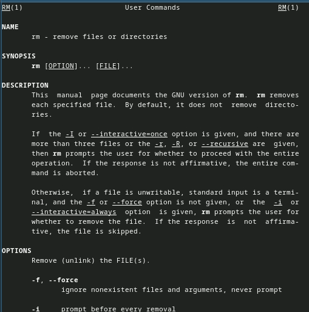

## Разбиение IPv4-сети на подсети

- Задание 1.2:
Задана сеть 10.10.1.64/26. Для заданной сети определите префикс, маску,
broadcast-адрес, число возможных подсетей, диапазон адресов узлов. Выделите в этой
сети подсеть на 30 узлов. Запишите характеристики для выделенной подсети.

## Разбиение IPv4-сети на подсети

- Выполнение задания 1.2:

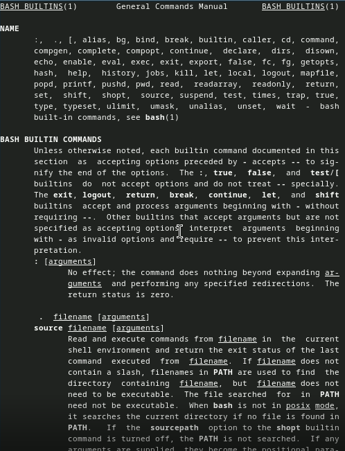

## Разбиение IPv4-сети на подсети

- Задание 1.3:
Задана сеть 10.10.1.0/26. Для этой сети определите префикс, маску, broadcast-
адрес, число возможных подсетей, диапазон адресов узлов. Выделите в этой сети
подсеть на 14 узлов. Запишите характеристики для выделенной подсети.

## Разбиение IPv4-сети на подсети

- Выполнение задания 1.3:

## Разбиение IPv6-сети на подсети

- Задание 2.1:
Задана сеть 2001:db8:c0de::/48. Охарактеризуйте адрес, определите маску,
префикс, диапазон адресов для узлов сети (краевые значения). Разбейте сеть на 2
подсети двумя способами — с использованием идентификатора подсети и с
использованием идентификатора интерфейса. Поясните предложенные вами варианты разбиения.

## Разбиение IPv6-сети на подсети

- Выполнение задания 2.1:

## Разбиение IPv6-сети на подсети

- Задание 2.2:
Задана сеть 2a02:6b8::/64. Охарактеризуйте адрес, определите маску, префикс,
диапазон адресов для узлов сети (краевые значения). Разбейте сеть на 2 подсети двумя
способами — с использованием идентификатора подсети и с использованием
идентификатора интерфейса. Поясните предложенные вами варианты разбиения.

## Разбиение IPv6-сети на подсети

- Выполнение задания 2.2:

## Настройка двойного стека адресации IPv4 и IPv6 в локальной сети

- Создание нового проекта в GNS3.

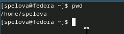

## Настройка двойного стека адресации IPv4 и IPv6 в локальной сети

- Размещение и соединение устройств в соответствии с топологией, приведённой в лабораторной работе. Присвоение новых названий устройствам.

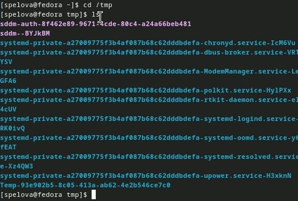

## Настройка двойного стека адресации IPv4 и IPv6 в локальной сети

- Включение захвата трафика.

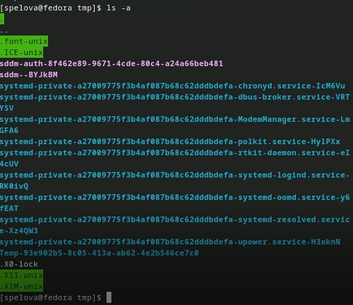

## Настройка двойного стека адресации IPv4 и IPv6 в локальной сети

- Настройка IPv4-адресации для интерфейса узла PC1-anspelov.

## Настройка двойного стека адресации IPv4 и IPv6 в локальной сети

- Настройка IPv4-адресации для интерфейса узла PC2-anspelov.

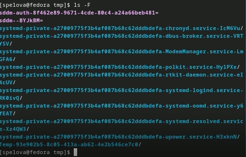

## Настройка двойного стека адресации IPv4 и IPv6 в локальной сети

- Настройка IPv4-адресации для интерфейса узла Server-anspelov.

## Настройка двойного стека адресации IPv4 и IPv6 в локальной сети

- Просмотр на PC1-anspelov конфигурации IPv4 и IPv6.

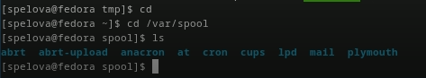

## Настройка двойного стека адресации IPv4 и IPv6 в локальной сети

- Просмотр на PC2-anspelov конфигурации IPv4 и IPv6.

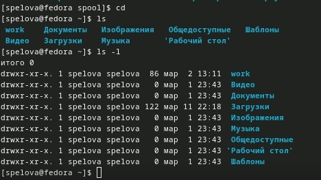

## Настройка двойного стека адресации IPv4 и IPv6 в локальной сети

- Настройка IPv4-адресации для интерфейсов локальной сети маршрутизатора FRR msk-anspelov-gw-01.

## Настройка двойного стека адресации IPv4 и IPv6 в локальной сети

- Проверка конфигурации маршрутизатора и настройки IPv4-адресации.

## Настройка двойного стека адресации IPv4 и IPv6 в локальной сети

- Проверка подключения с помощью команд ping и trace на PC1-anspelov и PC2-anspelov.

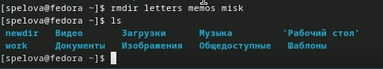

## Настройка двойного стека адресации IPv4 и IPv6 в локальной сети

- Настройка IPv6-адресации для интерфейса узла PC3-anspelov.

## Настройка двойного стека адресации IPv4 и IPv6 в локальной сети

- Настройка IPv6-адресации для интерфейса узла PC4-anspelov.

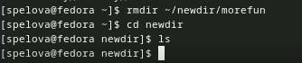

## Настройка двойного стека адресации IPv4 и IPv6 в локальной сети

- Настройка IPv6-адресации для интерфейса узла Server-anspelov.

## Настройка двойного стека адресации IPv4 и IPv6 в локальной сети

- Просмотр на PC3-anspelov конфигурации IPv4 и IPv6.

## Настройка двойного стека адресации IPv4 и IPv6 в локальной сети

- Просмотр на PC4-anspelov конфигурации IPv4 и IPv6.

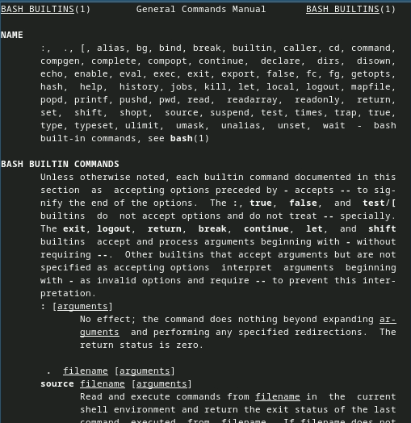

## Настройка двойного стека адресации IPv4 и IPv6 в локальной сети

- РНастройка IPv6-адресации для интерфейсов локальной сети маршрутизатора VyOS msk-anspelov-gw-02. Переход в режим конфигурирования, изменение имени устройства.

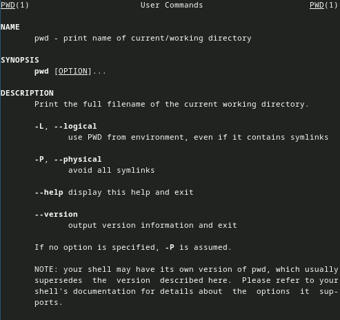

## Настройка двойного стека адресации IPv4 и IPv6 в локальной сети

- Назначение IPv6-адресов маршрутизатору msk-anspelov-gw-02.

## Настройка двойного стека адресации IPv4 и IPv6 в локальной сети

- Посмотр захваченный на соединении сервера двойного стека адресации с коммутатором трафик ARP, ICMP, ICMPv6

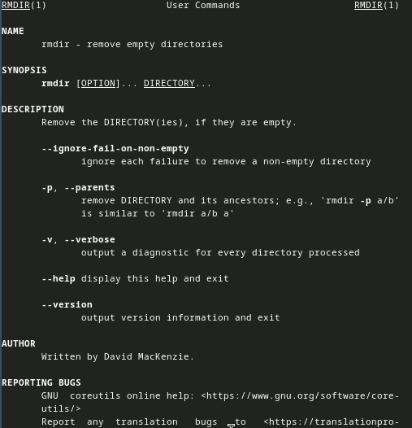

## Задание для самостоятельного выполнения

- Задание 4.1:
Задана топология сети. Предполагается, что маршрутизатор разбивает сеть на две
подсети с адресами IPv4 и IPv6:
– подсеть 1: 10.10.1.96/27; 2001:DB8:1:1::/64;
– подсеть 2: 10.10.1.16/28; 2001:DB8:1:4::/64.
Требуется: охарактеризовать подсети, указать, какие адреса в них входят.

## Задание для самостоятельного выполнения

- Выполнение задания 4.1:

## Задание для самостоятельного выполнения

- Задание 4.2:
Задана топология сети. Предполагается, что маршрутизатор разбивает сеть на две
подсети с адресами IPv4 и IPv6:
– подсеть 1: 10.10.1.96/27; 2001:DB8:1:1::/64;
– подсеть 2: 10.10.1.16/28; 2001:DB8:1:4::/64.
Требуется: предложить вариант таблицы адресации для заданной топологии и
адресного пространства, причём для интерфейсов маршрутизатора выбрать
наименьший адрес в подсети. Настроить IP-адресацию на маршрутизаторе VyOS и
оконечных устройствах, причём на интерфейсах маршрутизатора установить
наименьший адрес в подсети.

## Задание для самостоятельного выполнения

- Выполнение задания 4.2:

# Вывод

## Вывод

- В ходе выполнения лабораторной работы мы изучили принципы распределения и настройки адресного пространства на устройствах сети.