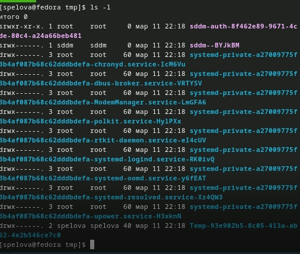
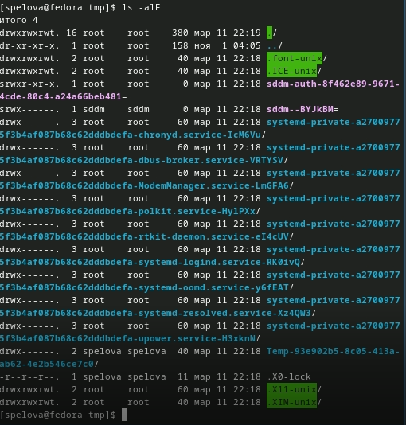
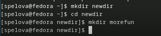
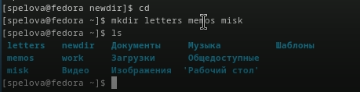
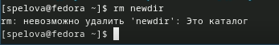
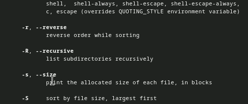
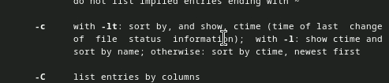
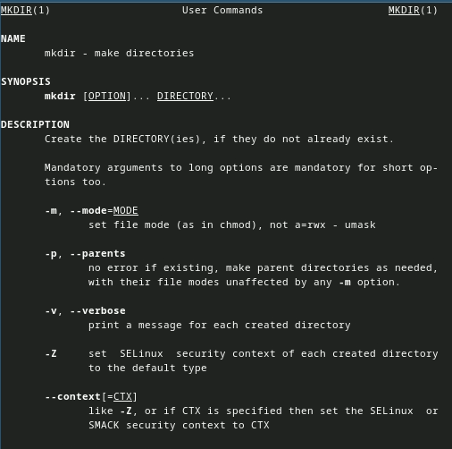

---
## Front matter
title: "Лабораторная работа №6"
subtitle: "Адресация IPv4 и IPv6. Двойной стек"                                                                                                                                                                                                                                                                                                                                                                                                                                                                                                                                                                                                                                                                                                                                                                                                                                                                                                                                                                                                                                                                                                                                                                                                                                                                                                                                                                                                                                                                                                                                                                                                                                                                                                                                                                                                                                                                                                                                                                                                                                                                                                                                                                                                                                                                                                                                                                                                                                                                                                                                                                                                                                                                                                                                                                                                                                                                                                                                                                                                                                                                                                                                                                                                                                                                                                                                                                                                                                                                                                                                                                                                                                                                                                                                                                                                                                                                                                                                                                                                                                                                                                                                                                                                                                                                                                                                                                                                                                                                                                                                                                                                                                                                                                                                                                                                                                                                                                                                                                                                                                                                                                                                                                                                                                                                                                                                                                                                                                                                                                                                                                                                                                                                                                                                                                                                                                                                                                                                                                                                                                                                                                                                                                                                                                                                                                                                                                                                                                                                                                                                                                                                                                                                                                                                                                                                                                                                                                                                                                                                                                                                                                                                                                                                                                                                                                                                                                                                                                                                                                                                                                                                                                                                                                                                                                                                                                                                                                                                                                                                                                                                                                                                                                                                                                                                                                                                                                                                                                                                                                                                                                                                                                                                                                                                                                                                                                                                                                                                                                                                                                                                                                                                                                                                                                                                                                                                                                                                                                                                                                                                                                                                                                                                                                                                                                                                                                                                                                                                                                                                                                                                                                                                                                                                                                                                                                                                                                                                                                                                                                                                                                                                                                                                                                                                                                                                                                                                                                                                                                                                                                                                                                                                                                                                                                                                                                                                                                                                                                                                                                                                                                                                                                                                                                                                                                                                                                                                                                                                                                                                                                                                                                                                                                                                                                                                                                                                                                                                                                                                                                                                                                                                                                                                                                                                                                                                                                                                                                                                                                                                                                                                                                                                                                                                                                                                                                                                                                                                                                                                                                                                                                                                                                                                                                                                                                                                                                                                                                                                                                                                                                                                                                                                                                                                                                                                                                                                                                                                                                                                                                                                                                                                                                                                                                                                                                                                                                                                                                                                                                                                                                                                                                                                                                                                                                                                                                                                                                                                                                                                                                                                                                                                                                                                                                                                                                                                                                                                                                                                                                                                                                                                                                                                                                                                                                                                                                                                                                                                                                                                                                                                                                                                                                                                                                                                                                                                                                                                                                                                                                                                                                                                                                                                                                                                                                                                                                                                                                                                                                                                                                                                                                                                                                                                                                                                                                                                                                                                                                                                                                                                                                                                                                                                                                                                                                                                                                                                                                                                                                                                                                                                                                                                                                                                                                                                                                                                                                                                                                                                                                                                                                                                                                                                                                                                                                                                                                                                                                                                                                                                                                                                                                                                                                                                                                                                                                                                                                                                                                                                                                                                                                                                                                                                                                                                                                                                                                                                                                                                                                                                                                                                                                                                                                                                                                                                                                                                                                                                                                                                                                                                                                                                                                                                                                                                                                                                                                                                                                                                                                                                                                                                                                                                                                                                                                                                                                                                                                                                                                                                                                                                                                                                                                                                                                                                                                                                                                                                                                                                                                                                                                                                                                                                                                                                                                                                                                                                                                                                                                                                                                                                                                                                                                                                                                                                                                                                                                                                                                                                                                                                                                                                                                                                                                                                                                                                                                                                                                                                                                                                                                                                                                                                                                                                                                                                                                                                                                                                                                                                                                                                                                                                                                                                                                                                                                                                                                                                                                                                                                                                                                                                                                                                                                                                                                                                                                                                                                                                                                                                                                                                                                                                                                                                                                                                                                                                                                                                                                                                                                                                                                                                                                                                                                                                                                                                                                                                                                                                                                                                                                                                                                                                                                                                                                                                                                                                                                                                                                                                                                                                                                                                                                                                                                                                                                                                                                                                                                                                                                                                                                                                                                                                                                                                                                                                                                                                                                                                                                                                                                                                                                                                                                                                                                                                                                                                                                                                                                                                                                                                                                                                                                                                                                                                                                                                                                                                                                                                                                                                                                                                                                                                                                                                                                                                                                                                                                                                                                                                                                                                                                                                                                                                                                                                                                                                                                                                                                                                                                                                                                                                                                                                                                                                                                                                                                                                                                                                                                                                                                                                                                                                                                                                                                                                                                                                                                                                                                                                                                                                                                                                                                                                                                                                                                                                                                                                                                                                                                                                                                                                                                                                                                                                                                                                                                                                                                                                                                                                                                                                                                                                                                                                                                                                                                                                                                                                                                                                                                                                                                                                                                                                                                                                                                                                                                                                                                                                                                                                                                                                                                                                                                                                                                                                                                                                                                                                                                                                                                                                                                                                                                                                                                                                                                                                                                                                                                                                                                                                                                                                                                                                                                                                                                                                                                                                                                                                                                                                                                                                                                                                                                                                                                                                                                                                                                                                                                                                                                                                                                                                                                                                                                                                                                                                                                                                                                                                                                                                                                                                                                                                                                                                                                                                                                                                                                                                                                                                                                                                                                                                                                                                                                                                                                                                                                                                                                                                                                                                                                                                                                                                                                                                                                                                                                                                                                                                                                                                                                                                                                                                                                                                                                                                                                                                                                                                                                                                                                                                                                                                                                                                                                                                                                                                                                                                                                                                                                                                                                                                                                                                                                                                                                                                                                                                                                                                                                                                                                                                                                                                                                                                                                                                                                                                                                                                                                                                                                                                                                                                                                                                                                                                                                                                                                                                                                                                                                                                                                                                                                                                                                                                                                                                                                                                                                                                                                                                                                                                                                                                                                                                                                                                                                                                                                                                                                                                                                                                                                                                                                                                                                                                                                                                                                                                                                                                                                                                                                                                                                                                                                                                                                                                                                                                                                                                                                                                                                                                                                                                                                                                                                                                                                                                                                                                                                                                                                                                                                                                                                               "
author: "Спелов Андрей Николаевич"

## Generic otions
lang: ru-RU
toc-title: "Содержание"

## Bibliography
bibliography: bib/cite.bib
csl: pandoc/csl/gost-r-7-0-5-2008-numeric.csl

## Pdf output format
toc: true # Table of contents
toc-depth: 2
lof: true # List of figures
lot: true # List of tables
fontsize: 12pt
linestretch: 1.5
papersize: a4
documentclass: scrreprt
## I18n polyglossia
polyglossia-lang:
  name: russian
  options:
	- spelling=modern
	- babelshorthands=true
polyglossia-otherlangs:
  name: english
## I18n babel
babel-lang: russian
babel-otherlangs: english
## Fonts
mainfont: PT Serif
romanfont: PT Serif
sansfont: PT Sans
monofont: PT Mono
mainfontoptions: Ligatures=TeX
romanfontoptions: Ligatures=TeX
sansfontoptions: Ligatures=TeX,Scale=MatchLowercase
monofontoptions: Scale=MatchLowercase,Scale=0.9
## Biblatex
biblatex: true
biblio-style: "gost-numeric"
biblatexoptions:
  - parentracker=true
  - backend=biber
  - hyperref=auto
  - language=auto
  - autolang=other*
  - citestyle=gost-numeric
## Pandoc-crossref LaTeX customization
figureTitle: "Рис."
tableTitle: "Таблица"
listingTitle: "Листинг"
lofTitle: "Список иллюстраций"
lotTitle: "Список таблиц"
lolTitle: "Листинги"
## Misc options
indent: true
header-includes:
  - \usepackage{indentfirst}
  - \usepackage{float} # keep figures where there are in the text
  - \floatplacement{figure}{H} # keep figures where there are in the text
---

# Цель работы

Целью данной работы является изучение принципов распределения и настройки адресного пространства на устройствах сети.

# Выполнение лабораторной работы

Задание 1.1:

Задана IPv4-сеть 172.16.20.0/24. Для заданной сети определите префикс, маску, broadcast-адрес, число возможных подсетей, диапазон адресов узлов. Разбейте сеть на 3 подсети с максимально возможным числом адресов узлов 126, 62, 62 соответственно.

Выполнение задания 1.1:

Префикс: 172.16.20.0
Маска: /24 означает, что первые 24 бита адреса являются сетевой частью маски, а оставшиеся 8 бит - частью для устройств в сети.
Broadcast-адрес: Этот адрес можно вычислить, инвертировав биты в сетевой части маски и применив их к заданной сети. В данном случае:
Сетевая часть: 172.16.20.0
Маска: 255.255.255.0 (или /24 в CIDR-нотации)
Для вычисления broadcast-адреса инвертируем биты в сетевой части маски:
Маска: 11111111.11111111.11111111.00000000
Инвертированная маска: 00000000.00000000.00000000.11111111
Теперь применим инвертированную маску к сети:
172.16.20.0 (сетевая часть) OR 0.0.0.255 (инвертированная маска) = 172.16.20.255
Broadcast-адрес: 172.16.20.255
Число возможных подсетей: 
Для сети с маской /24 (или 255.255.255.0) нет возможности разделить ее на дополнительные подсети без изменения маски.
Теперь разберем сеть на 3 подсети с максимально возможным числом адресов узлов:
Первая подсеть с 126 адресами:
Маска для 126 адресов - /25 (255.255.255.128)
Для этой подсети можно использовать адреса с 172.16.20.0 до 172.16.20.127.
Вторая подсеть с 62 адресами:
Маска для 62 адресов - /26 (255.255.255.192)
Для этой подсети можно использовать адреса с 172.16.20.128 до 172.16.20.191.
Третья подсеть также с 62 адресами:
Маска для 62 адресов - /26 (255.255.255.192)
Для этой подсети можно использовать адреса с 172.16.20.192 до 172.16.20.255.

Задание 1.2:

Задана сеть 10.10.1.64/26. Для заданной сети определите префикс, маску, broadcast-адрес, число возможных подсетей, диапазон адресов узлов. Выделите в этой сети подсеть на 30 узлов. Запишите характеристики для выделенной подсети.

Выполнение задания 1.2:

Префикс: 10.10.1.64
Маска: /26 означает, что первые 26 битов адреса являются сетевой частью маски, а оставшиеся 6 битов - частью для устройств в сети.
Broadcast-адрес: 
Этот адрес можно вычислить, инвертировав биты в сетевой части маски и применив их к заданной сети. 
В данном случае:
Сетевая часть: 10.10.1.64
Маска: 255.255.255.192 (или /26 в CIDR-нотации)
Для вычисления broadcast-адреса инвертируем биты в сетевой части маски:
Маска: 11111111.11111111.11111111.11000000
Инвертированная маска: 00000000.00000000.00000000.00111111
Теперь применим инвертированную маску к сети:
10.10.1.64 (сетевая часть) OR 0.0.0.63 (инвертированная маска) = 10.10.1.127
Broadcast-адрес: 10.10.1.127
Число возможных подсетей: 
Для этой сети с маской /26, нельзя создать дополнительные подсети без изменения маски.
Теперь давайте выделим подсеть с 30 узлами:
Для создания подсети с 30 узлами, мы можем использовать маску /27 (255.255.255.224), что даст нам 32 адреса, из которых 2 будут зарезервированы (один для сети и один для broadcast). Диапазон адресов узлов для этой подсети будет от 10.10.1.64 до 10.10.1.95.
Характеристики выделенной подсети:
Префикс: 10.10.1.64
Маска: /27 (255.255.255.224)
Broadcast-адрес: 10.10.1.95
Число возможных узлов: 30
Диапазон адресов узлов: от 10.10.1.65 до 10.10.1.94

Задание 1.3:

Задана сеть 10.10.1.0/26. Для этой сети определите префикс, маску, broadcast-адрес, число возможных подсетей, диапазон адресов узлов. Выделите в этой сети подсеть на 14 узлов. Запишите характеристики для выделенной подсети.

Выполнение задания 1.3:

Префикс: 10.10.1.0
Маска: /26 означает, что первые 26 битов адреса являются сетевой частью маски, а оставшиеся 6 битов - частью для устройств в сети.
Broadcast-адрес: Этот адрес можно вычислить, инвертировав биты в сетевой части маски и применив их к заданной сети. В данном случае:
Сетевая часть: 10.10.1.0
Маска: 255.255.255.192 (или /26 в CIDR-нотации)
Для вычисления broadcast-адреса инвертируем биты в сетевой части маски:
Маска: 11111111.11111111.11111111.11000000
Инвертированная маска: 00000000.00000000.00000000.00111111
Теперь применим инвертированную маску к сети:
10.10.1.0 (сетевая часть) OR 0.0.0.63 (инвертированная маска) = 10.10.1.63
Broadcast-адрес: 10.10.1.63
Число возможных подсетей: 
Для этой сети с маской /26, нельзя создать дополнительные подсети без изменения маски.
Теперь давайте выделим подсеть с 14 узлами:
Для создания подсети с 14 узлами, мы можем использовать маску /28 (255.255.255.240), что даст нам 16 адресов, из которых 2 будут зарезервированы (один для сети и один для broadcast). Диапазон адресов узлов для этой подсети будет от 10.10.1.0 до 10.10.1.15.
Характеристики выделенной подсети:
Префикс: 10.10.1.0
Маска: /28 (255.255.255.240)
Broadcast-адрес: 10.10.1.15
Число возможных узлов: 14
Диапазон адресов узлов: от 10.10.1.1 до 10.10.1.14
Таким образом, мы создали подсеть с 14 адресами в сети 10.10.1.0/26.

Задание 2.1:

Задана сеть 2001:db8:c0de::/48. Охарактеризуйте адрес, определите маску, префикс, диапазон адресов для узлов сети (краевые значения). Разбейте сеть на 2 подсети двумя способами — с использованием идентификатора подсети и с использованием идентификатора интерфейса. Поясните предложенные вами варианты разбиения.

Выполнение задания 2.1:

Давайте начнем с охарактеризации заданной IPv6-сети 2001:db8:c0de::/48:
Адрес: 2001:db8:c0de::
Маска: /48 означает, что первые 48 битов адреса являются сетевой частью маски, а оставшиеся 16 битов - частью для устройств в сети.
Префикс: 
Префикс это адрес сети без сжатия, который указан в запросе. 
В данном случае: 2001:db8:c0de::
Диапазон адресов для узлов: 
Диапазон адресов для узлов в данной сети будет от 2001:db8:c0de:: до 2001:db8:c0de:ffff:ffff:ffff:ffff:ffff. Эти адреса охватывают все возможные комбинации последних 16 битов.
Теперь давайте разделим сеть на 2 подсети двумя способами:
Способ 1: Разделение сети с использованием идентификатора подсети:
Для разделения сети на 2 подсети с использованием идентификатора подсети, мы увеличиваем длину маски на 1 бит, делая ее /49 для каждой подсети. Мы можем выбрать первую подсеть с идентификатором подсети "0" и вторую с идентификатором подсети "1". Диапазоны адресов будут следующими:
Первая подсеть:
Префикс: 2001:db8:c0de:0::/49
Диапазон адресов узлов: 
от 2001:db8:c0de:0:: до 2001:db8:c0de:1:ffff:ffff:ffff:ffff
Вторая подсеть:
Префикс: 2001:db8:c0de:1::/49
Диапазон адресов узлов: 
от 2001:db8:c0de:1:: до 2001:db8:c0de:1:ffff:ffff:ffff:ffff
Способ 2: Разделение сети с использованием идентификатора интерфейса:
Для разделения сети на 2 подсети с использованием идентификатора интерфейса, мы оставляем маску без изменений (/48), а изменяем значения идентификатора интерфейса. Диапазоны адресов будут следующими:
Первая подсеть:
Префикс: 2001:db8:c0de::
Диапазон адресов узлов: 
от 2001:db8:c0de:: до 2001:db8:c0de:ffff:ffff:ffff:ffff:ffff
Вторая подсеть:
Префикс: 2001:db8:c0de::
Диапазон адресов узлов: 
от 2001:db8:c0de::1 до 2001:db8:c0de:1ffff:ffff:ffff:ffff:ffff
Оба эти способа разделения сети дают две подсети, но различаются в том, как выбирается идентификатор (подсети или интерфейса). Выбор зависит от того, как будет организована сеть и какие устройства будут подключены к этим подсетям.

Задание 2.2:

Задана сеть 2a02:6b8::/64. Охарактеризуйте адрес, определите маску, префикс, диапазон адресов для узлов сети (краевые значения). Разбейте сеть на 2 подсети двумя способами — с использованием идентификатора подсети и с использованием идентификатора интерфейса. Поясните предложенные вами варианты разбиения.

Выполнение задания 2.2:

Давайте начнем с охарактеризации заданной IPv6-сети 2a02:6b8::/64:
Адрес: 2a02:6b8::
Маска: /64 означает, что первые 64 бита адреса являются сетевой частью маски, а оставшиеся 64 бита - частью для устройств в сети.
Префикс: 
Префикс это адрес сети без сжатия, который указан в запросе. В данном случае: 2a02:6b8::
Диапазон адресов для узлов: 
Диапазон адресов для узлов в данной сети будет от 2a02:6b8:: до 2a02:6b8:ffff:ffff:ffff:ffff:ffff:ffff. Эти адреса охватывают все возможные комбинации последних 64 бит.
Теперь давайте разделим сеть на 2 подсети двумя способами:
Способ 1: Разделение сети с использованием идентификатора подсети:
Для разделения сети на 2 подсети с использованием идентификатора подсети, мы увеличиваем длину маски на 1 бит, делая ее /65 для каждой подсети. Мы можем выбрать первую подсеть с идентификатором подсети "0" и вторую с идентификатором подсети "1". Диапазоны адресов будут следующими:
Первая подсеть:
Префикс: 2a02:6b8::/65
Диапазон адресов узлов: от 2a02:6b8:: до 2a02:6b8:0:ffff:ffff:ffff:ffff:ffff
Вторая подсеть:
Префикс: 2a02:6b8:1::/65
Диапазон адресов узлов: от 2a02:6b8:1:: до 2a02:6b8:1:ffff:ffff:ffff:ffff:ffff
Способ 2: Разделение сети с использованием идентификатора интерфейса:
Для разделения сети на 2 подсети с использованием идентификатора интерфейса, мы оставляем маску без изменений (/64), а изменяем значения идентификатора интерфейса. Диапазоны адресов будут следующими:
Первая подсеть:
Префикс: 2a02:6b8::
Диапазон адресов узлов: от 2a02:6b8:: до 2a02:6b8:ffff:ffff:ffff:ffff:ffff:ffff
Вторая подсеть:
Префикс: 2a02:6b8::
Диапазон адресов узлов: от 2a02:6b8::1 до 2a02:6b8:1:ffff:ffff:ffff:ffff:ffff
Оба эти способа разделения сети дают две подсети, но различаются в том, как выбирается идентификатор (подсети или интерфейса). Выбор зависит от того, как будет организована сеть и какие устройства будут подключены к этим подсетям.

Запустим GNS3 VM и GNS3 и создадим новый проект(рис. [-@fig:001]).

{#fig:001 width=70%}

В рабочем пространстве разместим и соединим устройства в соответствии с топологией, приведённой в лабораторной работе. Для подсети IPv4 используем маршрутизатор FRR, а для подсети с IPv6 — маршрутизатор VyOS. После чего изменим отображаемые названия устройств. Коммутаторам присвоим названия по принципу msk-anspelov-sw-0x, маршрутизаторам — по принципу msk-anspelov-gw-0x, VPCS — по принципу PCx-anspelov, где вместо x — порядковый номер устройства (рис. [-@fig:002]).

{#fig:002 width=70%}

Включим захват трафика на соединении между сервером двойного стека адресации и ближайшим к нему коммутатором (рис. [-@fig:003]).

{#fig:003 width=70%}

Настроим IPv4-адресацию для интерфейсов узлов PC1-anspelov(рис. [-@fig:004]).

{#fig:004 width=70%}

Настроим IPv4-адресацию для интерфейсов узлов PC2-anspelov (рис. [-@fig:005]).

{#fig:005 width=70%}

Настроим IPv4-адресацию для интерфейсов узлов Server-anspelov (рис. [-@fig:006]).

{#fig:006 width=70%}

Посмотрим на PC1-anspelov конфигурацию IPv4 и IPv6 (рис. [-@fig:007]).

{#fig:007 width=70%}

Посмотрим на PC2-anspelov конфигурацию IPv4 и IPv6(рис. [-@fig:008]).

{#fig:008 width=70%}

Теперь настроим IPv4-адресацию для интерфейсов локальной сети маршрутизатора FRR msk-anspelov-gw-01 (рис. [-@fig:009]).

{#fig:009 width=70%}

Проверим конфигурацию маршрутизатора и настройки IPv4-адресации (рис. [-@fig:010]).

{#fig:010 width=70%}

Проверим подключение с помощью команд ping и trace. Узлы PC1-anspelov и PC2-anspelov успешно отправляют эхо-запросы друг другу и на сервер с двойным стеком (Dual Stack Server)(рис. [-@fig:011]).

{#fig:011 width=70%}

Настроим IPv6-адресации для интерфейса узла PC3-anspelov.(рис. [-@fig:012]).

{#fig:012 width=70%}

Настроим IPv6-адресации для интерфейса узла PC4-anspelov. (рис. [-@fig:013]).

{#fig:013 width=70%}

Настроим IPv6-адресации для интерфейса узла Server-anspelov.(рис. [-@fig:014]).

{#fig:014 width=70%}

Посмотрим на PC3-anspelov конфигурации IPv4 и IPv6.(рис. [-@fig:015]).

{#fig:015 width=70%}

Посмотрим на PC4-anspelov конфигурации IPv4 и IPv6.(рис. [-@fig:016]).

{#fig:016 width=70%}

Настроим IPv6-адресацию для интерфейсов локальной сети маршрутизатора VyOS msk-anspelov-gw-02. Перейдём в режим конфигурирования, изменим имя устройства(рис. [-@fig:017]).

{#fig:017 width=70%}

Назначим IPv6-адреса маршрутизатору msk-anspelov-gw-02 (рис. [-@fig:018]).

{#fig:018 width=70%}

Посмотрим захваченный на соединении сервера двойного стека адресации с коммутатором трафик ARP, ICMP, ICMPv6(рис. [-@fig:019]).

{#fig:019 width=70%}

Задание 4.1:

Задана топология сети. Предполагается, что маршрутизатор разбивает сеть на две подсети с адресами IPv4 и IPv6: 
– подсеть 1: 10.10.1.96/27; 2001:DB8:1:1::/64; 
– подсеть 2: 10.10.1.16/28; 2001:DB8:1:4::/64.
Требуется: охарактеризовать подсети, указать, какие адреса в них входят.

Выполнение задания 4.1:

Подсеть 1 (IPv4):
Адрес подсети: 10.10.1.96
Префиксная длина (CIDR): /27
Сетевой адрес: 10.10.1.96
Broadcast-адрес: 10.10.1.127
Диапазон доступных хостов: с 10.10.1.97 до 10.10.1.126
Общее количество адресов в подсети: 32
Маска подсети: 255.255.255.224

Подсеть 1 (IPv6):
Адрес подсети: 2001:DB8:1:1::/64
Сетевой адрес: 2001:DB8:1:1::
Broadcast-адрес: В IPv6 нет broadcast-адресов, так как используется мультикаст и любые узлы в сети слушают этот мультикаст.

Подсеть 2 (IPv4):
Адрес подсети: 10.10.1.16
Префиксная длина (CIDR): /28
Сетевой адрес: 10.10.1.16
Broadcast-адрес: 10.10.1.31
Диапазон доступных хостов: с 10.10.1.17 до 10.10.1.30
Общее количество адресов в подсети: 16
Маска подсети: 255.255.255.240

Подсеть 2 (IPv6):
Адрес подсети: 2001:DB8:1:4::/64
Сетевой адрес: 2001:DB8:1:4::
Broadcast-адрес: В IPv6 нет broadcast-адресов.
Обе подсети предоставляют определенное количество IPv4 и IPv6 адресов для подключения устройств. Каждая подсеть имеет свой собственный уникальный сетевой идентификатор (сетевой адрес), который можно использовать для маршрутизации внутри сети.

Задание 4.2:

Задана топология сети. Предполагается, что маршрутизатор разбивает сеть на две подсети с адресами IPv4 и IPv6: 
– подсеть 1: 10.10.1.96/27; 2001:DB8:1:1::/64; 
– подсеть 2: 10.10.1.16/28; 2001:DB8:1:4::/64.
Требуется: предложить вариант таблицы адресации для заданной топологии (Рис. 4.2) и адресного пространства, причём для интерфейсов маршрутизатора выбрать наименьший адрес в подсети. Настроить IP-адресацию на маршрутизаторе VyOS и оконечных устройствах, причём на интерфейсах маршрутизатора установить наименьший адрес в подсети.

Выполнение задания 4.2:

Для предоставления таблицы адресации для заданной топологии и выбора наименьшего адреса в каждой подсети, давайте создадим таблицу, которая включает в себя адреса для интерфейсов маршрутизатора и дополнительных устройств (например, серверов или компьютеров). Вот таблица адресации:
Подсеть 1 (IPv4):
Сеть: 10.10.1.96/27
Маршрутизатор (Interf. 1): 10.10.1.97
Дополнительный устройство 1: 10.10.1.98
Дополнительное устройство 2: 10.10.1.99

Подсеть 2 (IPv4):
Сеть: 10.10.1.16/28
Маршрутизатор (Interf. 1): 10.10.1.17
Дополнительное устройство 1: 10.10.1.18
Дополнительное устройство 2: 10.10.1.19

Подсеть 1 (IPv6):
Сеть: 2001:DB8:1:1::/64
Маршрутизатор (Interf. 1): 2001:DB8:1:1::1
Дополнительное устройство 1: 2001:DB8:1:1::2
Дополнительное устройство 2: 2001:DB8:1:1::3

Подсеть 2 (IPv6):
Сеть: 2001:DB8:1:4::/64
Маршрутизатор (Interf. 1): 2001:DB8:1:4::1
Дополнительное устройство 1: 2001:DB8:1:4::2
Дополнительное устройство 2: 2001:DB8:1:4::3

# Выводы

В ходе выполнения лабораторной работы мы изучили принципы распределения и настройки адресного пространства на устройствах сети.

# Список литературы{.unnumbered}

::: {#refs}
:::
